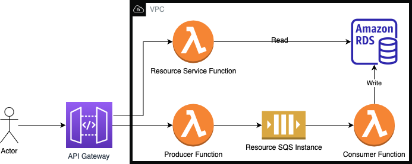

# Popl-AWS-Demo

## Setup Instructions

This demo app is designed to be completely reproducible. To that effect, there are terraform scripts for shared services and 
serverless handles all of the infrastructure for lambda specific functionality (via CloudFormation).

In order to setup, you will first need to export your AWS credentials to the console. In order to set everything up, you'll need
permissions to create Lambdas, API Gateways, RDS instances, and SQS instances; and to retrieve VPC information

At a high level, first, we created the shared services (terraform, rds secret credentials, and vpc info secret), then we create 
the serverless architecture and spin the lambdas up.

To do this, you'll need to run the following 

```
make up
```

This will create and deploy everything needed

## Usage

todo: OpenAPI spec instead of this 

`Resource` objects can be added to the database asynchronously by POSTing an object to the producer function. That will add a message to the SQS queue which 
will be picked up by the consumer function, and added to the database

```
POST /resource
{
    "name": string,
    "nickname": string,
    "type": string
}
```

An example event can be found in events/test-producer.json, which can be run with 

```
sls invoke --function producer --path events/test-producer.json 
```

Once added to the database (should happen pretty much immediately), `Resource` obejcts can be retrieved from the database through either of these endpoints

```
GET /resource 
GET /resource/{id}
```

The first will get all resource objects and the second will get an individual one by id. Similar event json files have been included for testing purposes which you can invoke with  

```
sls invoke --function resource-service --path events/test-resources.json 
```
and
```
sls invoke --function resource-service --path events/test-resource.json 
```

## Functions

### Producer

Writes a message to the specified SQS queue-- expected to be in the format of the `Resource` interface. This writes to a queue instead of writing 
to the database directly is because this is just a demo. This is meant to mock a more process-intensive function call that takes too long to 
immediately write to the database, so it uses a queue so that the consumer can asynchronously process the data

### Consumer

Reads a message from the SQS queue and writes it into a MySQL RDS instance

### Resource-Service 

API that exposes Resource objects to the user from the database. Although the producer and this both have resource endpoints and it could make sense 
to put them both in the same lambda, they do different things. Similarly, this function has a database dependency which affects cold start startup time.
By having the producer be a separate lambda, it isn't dependent on the database connection and has faster cold starts

## Architecture


